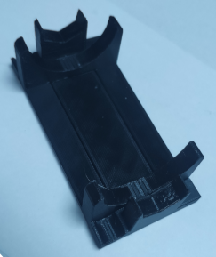
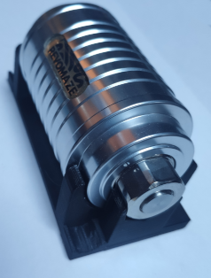
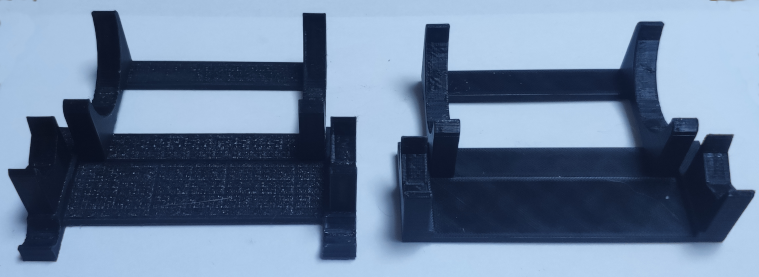
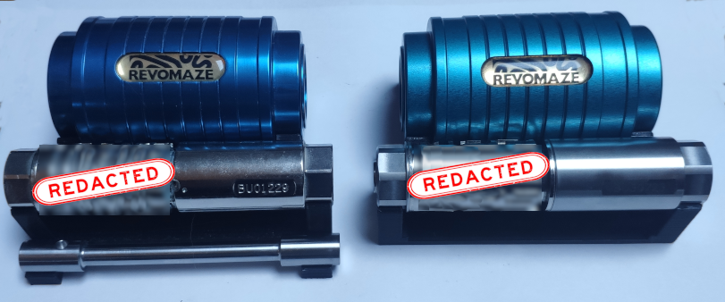

# Yet Another REVOMAZE Display Stand

## Display Stand for your REVOMAZE collection

A 3D Printable display stand for your REVOMAZE puzzles.  Consisting of two stacking parts that can be configured to display either a solved or and unsolved maze. Both V1 and V3 mazes are supported.

### Unsolved
  

### Solved

## Printing and assembly instructions

The stl folder contains three files, two of which will be needed for a complete stand.  Print the revomaze_stand_sleeve.stl and one of either revomaze_stand_mazetube_V1.stl or revomaze_stand_mazetube_V3.stl.  If in doubt, the V1 stand will for all cases. The V3 stand just removes the drawbar holder from the front to make it look a little cleaner cosmetically.

The samples were printed with PETG but any filament should work. This is a friction-fit design so you might need to adjust your printing parameters for your machine and filament choice to get a good fit.

For unsolved mazes, The sleeve holder should stack on top of the mazetube holder. There should be just enough friction to hold the two pieces together.

When you have a solved maze to display, re-stack the pieces so the mazetube holder is in front. The two pieces should still hold together by friction between the feet of the parts.  For a V1 maze, orient the mazetube holder so the scooped feet are in front in order to hold the drawbar.
